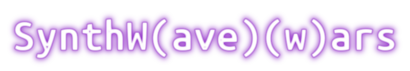

# SynthWars

This is a rhythm game written in Python using PyGame. 

The main feature is that it now has (limited) support of all the Beat Saber levels (a very popular game in the music genre, but available only in VR). 

Theoretically, you can download any level from [BeatSaver](beatsaver.com), unpack it, place under ./levels folder and just play! For now only the most basic features are supported, but it's enough to have fun :). For example, you can [check my levels on GDrive](https://drive.google.com/drive/folders/1AncFTVkZhaEXr0i8L3L4irV6cWFKjjVy?usp=sharing) and place it in `./levels` (not included due to DMCA concerns over music files)

The concept is very basic: it's a 2D scroller where you can switch between 4 lines. Notes are approaching you, and if you will hit right in the beat of the song, you'll get a lot of points. Use scoreboard and challenge your friends :)

Some preventive measures have been taken for trivial ways to play (such as clicking all the possible buttons all the time). Some math has been used to keep the song in sync no matter what's the FPS, so you should be in a good shape unless you've got a potato PC. Check it out yourself!
## Preview

## Credits:
[free-game-assets](https://free-game-assets.itch.io/free-3-cyberpunk-sprites-pixel-art) for the sick-looking Cyberpunk Punk sprites!

[blackdragon1727](https://blackdragon1727.itch.io/pixel-mini-effect) for the pixel effects I've used for my notes. They're gorgeous ❤️

[JetBrains](https://github.com/JetBrains/JetBrainsMono) for the JetBrains Mono font used in the game to give it sleek nerd-ish look.

[BeatSaber](https://beatsaber.com) for the awesome game idea and giant thanks to the thriving community of this game! Love you guys :)

[BeatSage](https://beatsage.com/) - a seriously impressive GNN-based Beat Saber map generator. Give it a link to YT\SC and watch.

[forslund](https://github.com/forslund/pyParallax) for the simple parallax library that saved me some very valuable time when I was approaching the deadline.

